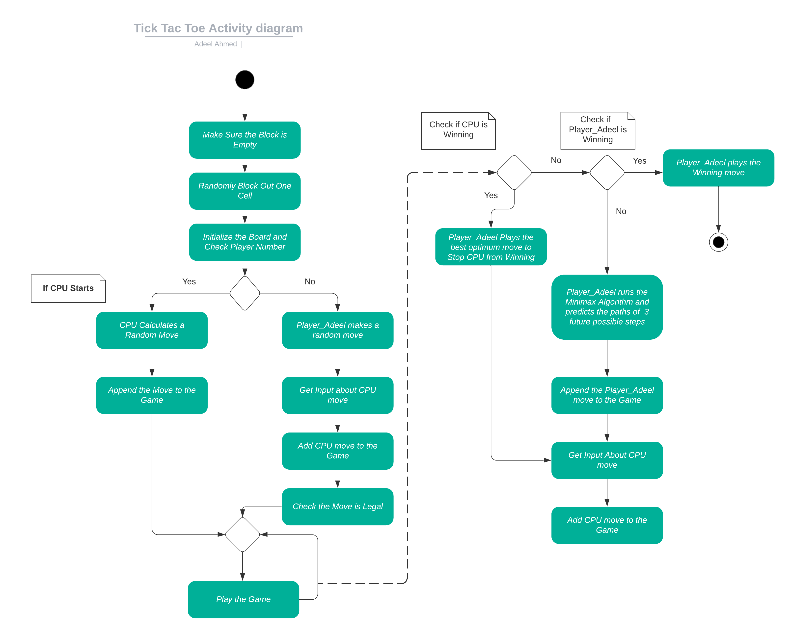

# Advanced_Software_Architectures_TickTackToe

## Overview

This repository contains the implementation of a Tic Tac Toe game in C++ with a 4x4 board where one cell is randomly blocked at the start. The game is designed to allow a player (Player Adeel) to compete against a CPU player using the Minimax Algorithm to make optimal moves. The Minimax Algorithm is optimized with a depth cutoff to handle the complexity, with future potential for Alpha-Beta Pruning.The project demonstrates how to implement a custom player class that integrates with pre-existing game logic.

## Repository Structure

- **Code**: Contains all the C++ code files related to the Tic Tac Toe game, including the implementation of the new player class and its test case file. To use these files:
  - Add the files to your project.
  - If you have more computer players, please update the player number in the respective C++ file.

- **Results**: Contains images of the code output and test results.

- **Documentation**: The documentation file, providing detailed information about the project, is stored here.

- **Misc**: Includes activity diagrams, game states, winning board states, and all other miscellaneous images and files. A backup copy of the working code is also available in this folder, but note that test cases are not included in this backup.

## Activity Diagram

The activity diagram below provides an overview of the logic implemented in the game:

### Explanation of the Activity Diagram

1. **Initialization**: The game starts by ensuring that the randomly blocked cell is empty, followed by initializing the board and determining the player number.
2. **CPU's Turn**: 
    - If the CPU starts, it calculates a random move and appends it to the game.
    - The game checks if the move is legal and then continues.
3. **Player Adeel's Turn**: 
    - If it's Player Adeel's turn, the algorithm checks if the CPU is winning. If true, Player Adeel plays the best move to stop the CPU from winning.
    - If Player Adeel is in a winning position, the winning move is played.
    - If neither player is in a winning position, Player Adeel uses the Minimax Algorithm to predict the paths of three future moves and makes the most optimal move.
4. **Game Continuation**: The game continues until a winner is determined or all moves are exhausted.

## Code Design

### Player Adeel Class

The custom player class, **Player Adeel**, overrides the `getNextMove()` function, which is the entry point for determining the player's move. The class utilizes the Minimax Algorithm to ensure that the player makes the most optimal moves based on the current game state.

### Minimax Algorithm

The Minimax Algorithm is central to the decision-making process in this game. It simulates future moves, evaluating potential outcomes to ensure that Player Adeel either wins or prevents the CPU from winning. Due to the complexity of the 4x4 board, a depth limit is applied to the algorithm to keep the game running efficiently.

### Results and Analysis

The implementation includes a depth analysis, where the depth of the Minimax Algorithm was varied and tested across 500 games. The optimal depth was found to be 3, balancing performance and decision-making quality.

## Future Prospects

While the current implementation is robust, there is room for improvement by incorporating the Alpha-Beta Pruning Algorithm, which could enhance the efficiency of the Minimax Algorithm, particularly for larger board sizes.

